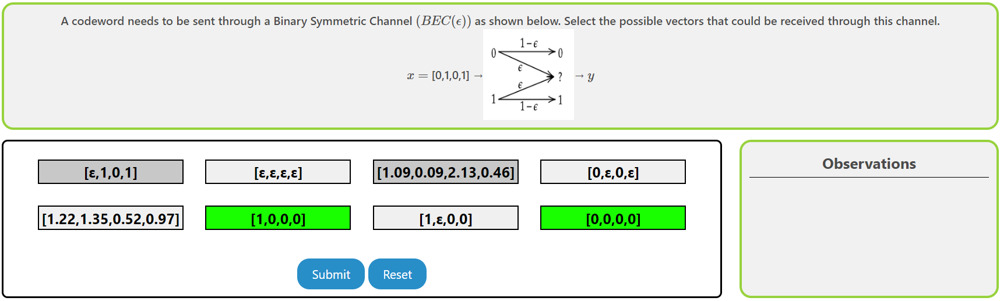
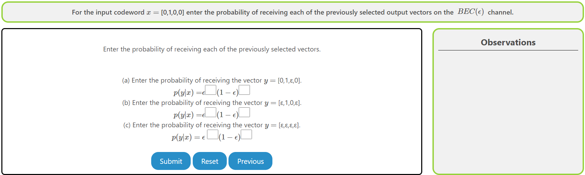
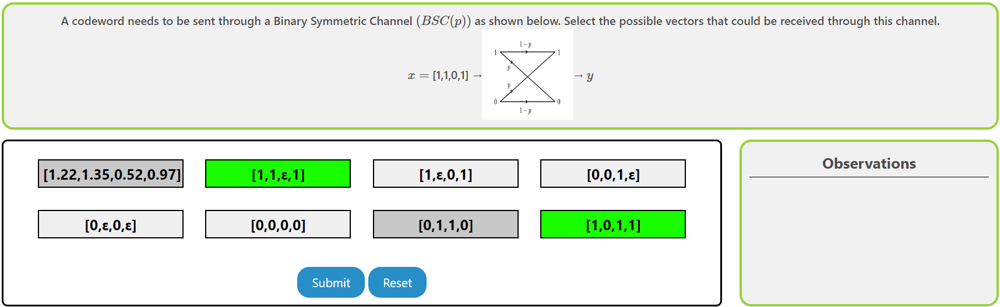
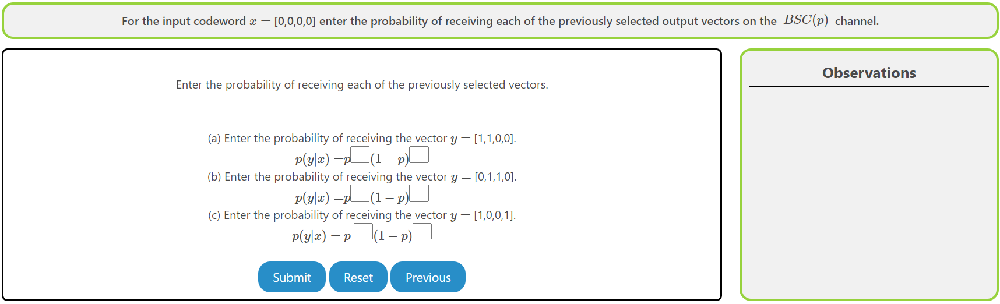

### Procedure

The experiment consists of three sub-experiments, through which the user will be systematically understanding the essential mathematical aspects of three important probabilistic channels, discussed in the theory part of this experiment. These channels are : 

1. The Binary Erasure Channel, which erases each bit transmitted independently with probability $\epsilon$. The erasure symbol is denoted by $?$. 
2. The Binary Symmetric Channel, which flips the bit transmitted independently with probability $p$. 
3. The Additive White Gaussian Channel, which adds a real and independent noise value (sampled from a Gaussian distribution with $0$ mean and variance $N_0/2$). 

The detailed working of this experiment is as follows. 

## Overview of the Experiment window

    

The experiment window consists of the following components:
1. **Task tab**: The task tab contains the list of tasks that need to be performed in the experiment. The user can navigate to any task by clicking on the corresponding task in the task tab.
2. **Instruction box**: The instruction box displays step-by-step instructions to perform the task.
3. **Question box**: The question box displays the question to be answered by the user.
4. **Observation box**: The observation box displays the feedback messages based on the user's input.
5. **Action box**: The action box contains the input elements and buttons to perform the task.

## Experiment 1: Binary Input Discrete Memoryless Channels

There are three tasks in this sub-experiment.

### Task 1: Binary Erasure Channel

1. **Select Output Vectors**: Select the possible output vectors ($\vec{y}$) of the Binary Erasure Channel $BEC(\epsilon)$ whose input vector $\vec{x}$ is given. After selection, the boxes will turn green and deselecting them will turn them to gray.
    
  

     
    <ul>
    <li> Click on <strong>Submit</strong> to verify if the selected vectors are the possible output vectors. </li>
    <li> Click on <strong>Reset</strong> to clear the selected vectors and start over. </li>
    <li> Click on <strong>Next</strong> to go to the next sub-experiment.  </li>
    <li> The observation box will display feedback messages accordingly. </li>  
    </ul>
     
    
    

2. **Enter Probability**: For the input vector $\vec{x}$, enter the probability of receiving the previously selected output vectors $\vec{y}$.
    
  

     
    <ul>
    <li> Click on <strong>Submit</strong> to verify if the entered probabilities are correct. </li>
    <li> Click on <strong>Reset</strong> to start over the experiment from the previous sub-experiment. </li>
    <li> Click on <strong>Previous</strong> to go to the previous sub-experiment.  </li>
    <li> The observation box will display feedback messages accordingly. </li>  
    </ul>
     
    
    
    
    

### Task 2: Binary Symmetric Channel

1. **Select Output Vectors**: Select the possible output vectors ($\vec{y}$) of the Binary Symmetric Channel $BSC(p)$ whose input vector $\vec{x}$ is given. After selection, the boxes will turn green and deselecting them will turn them to gray.
    
  

     
    <ul>
    <li> Click on <strong>Submit</strong> to verify if the selected vectors are the possible output vectors. </li>
    <li> Click on <strong>Reset</strong> to clear the selected vectors and start over. </li>
    <li> Click on <strong>Next</strong> to go to the next sub-experiment.  </li>
    <li> The observation box will display feedback messages accordingly. </li>  
    </ul>
     
    
    

2. **Enter Probability**: For the input vector $\vec{x}$, enter the probability of receiving the previously selected output vectors $\vec{y}$.
    
  

     
    <ul>
    <li> Click on <strong>Submit</strong> to verify if the entered probabilities are correct. </li>
    <li> Click on <strong>Reset</strong> to start over the experiment from the previous sub-experiment. </li>
    <li> Click on <strong>Previous</strong> to go to the previous sub-experiment.  </li>
    <li> The observation box will display feedback messages accordingly. </li>  
    </ul>
     
    
    
    
    