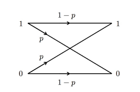
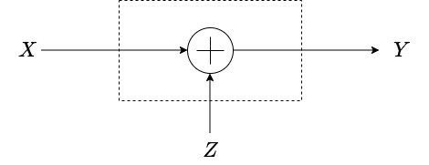

# Theory 

## What is a Communication Channel? 

A communication channel is a medium through which communication happens. In this virtual lab, we are dealing with specifically those channels that accept binary-valued inputs. We call these channels as binary-input channels. For some binary channels, we write the possible set of inputs as the *logical bits* $\{0,1\}$. That is, at any time instant, we can send a logical "0" through the channel, or a logical "1". Equivalently, we may also write the binary alphabet in the *bipolar* form, which is written as $\{+1,-1\}$. Normally, we take the logical-bit to bipolar mapping as $0\to +1$ and $1\to -1$.

We generally use the notation $\cal X$ to denote the input alphabet of the channel. From the point of view of the receiver, the input to the channel is unknown, and hence is modelled as a random variable with some input probability distribution. We denote this input random variable as $X$. Similarly, the output of the channel, is a random variable denoted by $Y$. We assume that the output alphabet, the set of all values that the output can possibly take, is denoted by $\cal Y$. 

## Types of Channels considered in this virtual lab

The problem of designing good communication systems arises precisely due to the existence of *noise* in communication channels. The noise in the communication channel is generally modelled via the conditional probabilities (of the output value, given the input value). We consider some three important types of communication channels (or in other words, noise models) in this virtual lab.

1. The **Binary Erasure Channel**: The noise in this channel is modelled as a *bit-erasure*, which denotes the transmitted bit was erased or lost. Formally, in this channel, the input alphabet is the set of logical bits, i.e., ${\cal X}=\{0,1\}$ and the output alphabet is the set of logical bits along with the erasure symbol $?$, i.e., ${\cal Y}=\{0,1,?\}$. The erasure symbol $?$ denotes that the input symbol was *erased* during the process of transmission through the channel. The binary erasure channel, denoted formally as $BEC(\epsilon)$, has the property that the bit that is transmitted is erased with probability $\epsilon$. Here, $\epsilon$ denotes the *erasure probability*, and we assume $\epsilon$ is a real number between $0$ and $1$, i.e., $\epsilon\in(0,1)$. 

---

    
    
<b>Binary Erasure Channel</b>

---

2. The **Binary Symmetric Channel**: In this channel, the input alphabet is the set of logical bits, i.e., ${\cal X}=\{0,1\}$ and the output alphabet is the set of logical bits  i.e., ${\cal Y}=\{0,1\}$. The noise of this channel is characterized by bit-flips (i.e., a transmitted $0$ bit is received as a $1$, or vice-versa). In the binary symmetric channel denoted by $BSC(p)$, we assume that bit-flip happens with some probability $p$, where $p$ is a real number and $p\in(0,1)$. 

---

    
    
<b>Binary Symmetric Channel</b>

---

3. The **Additive White Gaussian Noise Channel (AWGN)**: The AWGN channel, accepts a real number as an input, and adds to it a noise random variable $Z$ that is distributed independently according to a Gaussian distribution ${\cal N}(0,N_0/2)$, with zero-mean and variance $N_0/2$. Thus, the input alphabet and the output alphabet are both ${\cal X}=\mathbb{R}$. The relationship between the input $X$ and the output $Y$ is then given as 

$$Y=X+Z.$$ 

---

    
    
<b>Gaussian Channel</b>

---

## Conditional Distribution Associated with the Communication Channel

We can also describe the channels above using the conditional distribution of the output random variable $Y$ given by the input random variable $X$. Specifically, we have the following. 

1. **Binary Erasure Channel**: The conditional distribution of this channel $BEC(\epsilon)$ is given as follows.

$$
p_{Y|X}(y|x)=
\begin{cases}
1-\epsilon&\text{if}~ y=x, \forall x \in\{0,1\},\\
\epsilon & \text{if}~y=? . 
\end{cases}
$$

2. **Binary Symmetric Channel**: The conditional distribution of this channel $BSC(p)$ is given as follows.

$$
p_{Y|X}(y|x)=
\begin{cases}
1-p&\text{if}~ y=x, \forall x \in\{0,1\},\\
p & \text{if}~x\neq y . 
\end{cases}
$$

3. **AWGN Channel**: For this channel, we have
$$
p_{Y|X}(y|x)=\frac{1}{\sqrt{\pi N_0}}e^{\frac{-(y-x)^2}{N_0}}, \forall x,y \in \mathbb{R}. 
$$

## The Memoryless Property of the Channels

We assume that the three channels we have considered in this virtual lab have the *memoryless* property and exist *without feedback*. To be precise, if we transmit a $n$-length sequence of bits denoted by $(x_1,\ldots,x_n)$ through any of these channels, the output is a sequence of bits $(y_1,\ldots,y_n)$, with probability as follows. 

$$p((y_1,\ldots,y_n)|(x_1,\ldots,x_n))=p(y_1|x_1)\cdots p(y_n|x_n)=\Pi_{i=1}^n p(y_i|x_i).$$

The above property is a naturally expected property. For instance, consider the channel $BEC(\epsilon)$. The probability of receiving $(?,0,?,1)$ when transmitting $(1,0,0,1)$ is given by 
$$
\begin{aligned}
p((?,0,?,1)|(1,0,0,1))&=p(?|1)p(0|0)p(?|0)p(1|1)\\
&=\epsilon\cdot(1-\epsilon)\cdot \epsilon\cdot (1-\epsilon)\\
&=\epsilon^2(1-\epsilon)^2.
\end{aligned}
$$

More generally, we can say the following. Let $\bm{x}\in \mathbb{F}_2^n$ be an $n$-length binary vector. A vector $\bm{y} \in \{0,1,?\}^n$ is said to be *compatible* with $\bm{x}$ if $\bm{y}$ and $\bm{x}$ agree (i.e., are equal) in all positions which are unerased (not equal to "?" symbol) in $\bm{y}$. Otherwise, they are *not compatible*. For instance, the vectors $(0,1,0,1)$ and $(?,1,0,?)$ are compatible. However, the vectors $(0,1,0,1)$ and $(?,1,1,?)$ are not compatible, since the third bits of the two vectors are both unerased and not equal. 

 For any vector $\bm{y}\in\{0,1,\epsilon\}^n$, let $w_e(\bm{y})$ denote the number of erased symbols in $\bm{y}$. Then for any $\bm{x}\in\mathbb{F}_2^n$, we have, in the memoryless $BEC(\epsilon)$ channel, the following to be true. 
$$p(\bm{y}|\bm{x})=\begin{cases}
\epsilon^{w_e(\bm{y})}(1-\epsilon)^{n-w_e(\bm{y})} & \text{if}~\bm{x} ~\text{and}~\bm{y}~\text{are compatible}\\
0 & \text{otherwise}. 
\end{cases}$$ 

Turning our focus to the $BSC(p)$, we have the following. For any $\bm{x},\bm{y}\in\mathbb{F}_2^n$, let $d(\bm{x},\bm{y})$ denote the Hamming distance (number of positions where $\bm{x}$ and $\bm{y}$ have distinct values). For example, $d((1,0,1,0),(0,0,1,1))=2$ as the two vectors are distinct in the first and the fourth locations. Then, for the $BSC(p)$ memoryless channel, we have the following.
$$p(\bm{y}|\bm{x})=p^{d(\bm{x},\bm{y})}(1-p)^{n-d(\bm{x},\bm{y})}.$$

For the memoryless AWGN channel, we have, for any two vectors $\bm{x},\bm{y}\in\mathbb{R}^n$, 
$$p(\bm{y}|\bm{x})=\frac{1}{(\pi N_0)^{n/2}}e^{-\frac{(||\bm{y}-\bm{x}||^2)}{N_0}}.$$